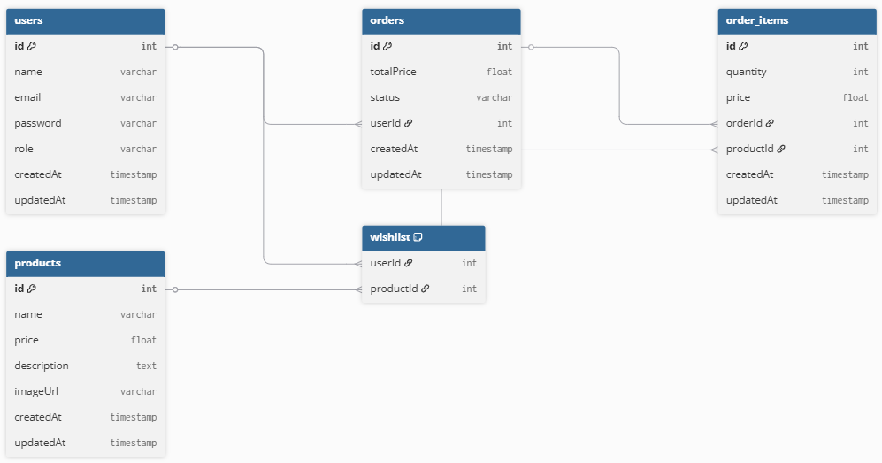
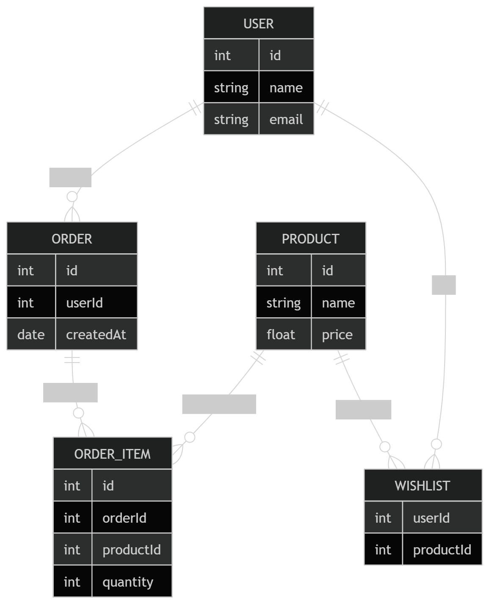

### 🔁 Quick Cheat Sheet

| Relationship Type | Sequelize                  |
|------------------|---------------------------|
| One → Many       | hasMany + belongsTo       |
| Many → Many      | belongsToMany             |
| One → One        | hasOne + belongsTo        |

---

### 🧩 Your Architecture (Final Understanding)

✔ **Orders** → transactional data → direct relation → `hasMany`  
✔ **OrderItems** → breakdown of order → direct relation → `hasMany`  
✔ **Wishlist** → flexible mapping → needs join table → `belongsToMany`  

---

### ⚡ Simple Mental Trick (Very Useful)

| Question                          | If YES → Use           |
|----------------------------------|------------------------|
| Can A have many B?               | → maybe `hasMany`      |
| Can B also have many A?          | → `belongsToMany`      |
| Can B have only ONE A?           | → `belongsTo`          |


If you want to turn that content into a proper `.md` (Markdown) file, here’s how to do it cleanly and correctly.

### 1. Create a Markdown file

Just create a file with a `.md` extension, for example:

```
wishlist-guide.md
```

### 2. Paste and format your content

Your content is already close, but Markdown looks cleaner with headings and code blocks formatted like this:

````md
# 🧠 Step 4: How You Will Use It

## ✅ Add to Wishlist
```js
await Wishlist.create({
  userId: req.user.id,
  productId,
});
````

## ✅ Get Wishlist (IMPORTANT — using `as`)

```js
const user = await User.findByPk(req.user.id, {
  include: [
    {
      model: Product,
      as: "wishlist",
      attributes: ["id", "name", "price", "imageUrl"],
    },
  ],
});
```

## ✅ Remove from Wishlist

```js
await Wishlist.destroy({
  where: {
    userId: req.user.id,
    productId,
  },
});
```

---

# ⚠️ Step 5: Common Mistake (Don’t Do This)

❌ This will fail:

```js
include: [Product]
```

✔️ Must use:

```js
include: [{ model: Product, as: "wishlist" }]
```

---

# 🧠 Final Mental Model

```
User ────< Wishlist >──── Product
```

* No direct `User → Product` column
* `Wishlist` is the bridge

```


This is the *exact* missing link, so let’s make it crystal clear.

You’re asking:

> “How does `include` automatically go through the `WishList` table to get `productId`?”

---

# 🧠 The key idea (this unlocks everything)

When you wrote:

```js
User.belongsToMany(Product, {
  through: WishList,
  foreignKey: "userId",
  as: "wishlist"
});
```

👉 Sequelize **stores metadata internally** like:

```text
User --(userId)--> WishList --(productId)--> Product
```

It literally builds a **map of how to join tables**.

---

# 🔗 What Sequelize “remembers”

From your association, Sequelize now knows:

* Start from **User**
* Go to **WishList** using `userId`
* Then go to **Product** using `productId`

---

# ⚙️ Now your query

```js
User.findByPk(userId, {
  include: [
    {
      model: Product,
      as: "wishlist"
    }
  ]
});
```

You’re basically saying:

> “Start from User and follow the `wishlist` relationship”

---

# 🚀 What Sequelize actually does internally
---------------------------------------------------
It translates your query into something like:

```sql
SELECT Products.*
FROM Users
LEFT JOIN WishLists 
  ON Users.id = WishLists.userId
LEFT JOIN Products 
  ON WishLists.productId = Products.id
WHERE Users.id = userId;
```

---

# 🧩 Step-by-step flow (very important)

### 1. You pass:

```js
userId = 1
```

---

### 2. Sequelize finds user

```text
User.id = 1
```

---

### 3. Uses association

Because of:

```js
through: WishList
```

It knows:

👉 “Next table is WishList”

---

### 4. Uses foreignKey

```js
foreignKey: "userId"
```

So it runs:

```text
Find WishList rows where userId = 1
```

---

### 5. Gets productIds

From WishList:

```text
userId | productId
------------------
1      | 10
1      | 11
```

👉 Extracts:

```text
productIds = [10, 11]
```

---

### 6. Fetch Products

```text
SELECT * FROM Products WHERE id IN (10, 11)
```

---

### 7. Attach to result

```js
{
  id: 1,
  name: "Tushar",

  wishlist: [
    { id: 10, name: "iPhone" },
    { id: 11, name: "Shoes" }
  ]
}
```

---

# 🔥 Why you don’t see this happening

Because Sequelize hides all this:

* joins
* mapping
* extracting IDs

👉 You only see:

```js
include: [{ model: Product, as: "wishlist" }]
```

---

# ⚠️ Important: `include` is NOT magic

It works **only because of this**:

```js
belongsToMany + through + foreignKey
```

If you remove that → ❌ it breaks

---

# 🎯 Mental model (lock this in)

Think like this:

```text
include → "follow this relationship path"
```

And Sequelize already knows the path:

```text
User → WishList → Product
```

---

# 💥 One-line answer

> `include` works because Sequelize already knows the path `User → WishList → Product` from your `belongsToMany` setup, so it automatically joins through `WishList` using `userId` and `productId`.

---

If you want, I can next show:

* how Sequelize behaves if you rename `userId` or `productId` (very important edge case)
* or how to debug when include returns empty (super common bug)
